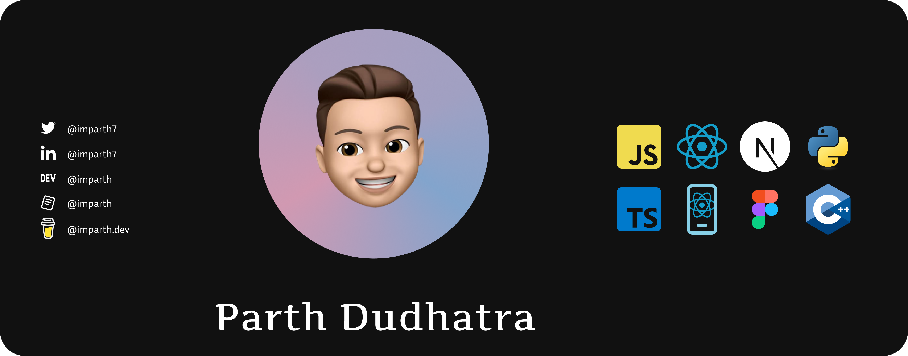

# Hi there, I'm Parth! 👋

Welcome to my GitHub profile! I'm thrilled to have you here. Let me introduce myself and give you a glimpse into my world.

## About Me

I am a Front-end Developer with a passion for creating good stuff. I love creating unbelievable stuff. Through my work and projects, I strive to create extraordinary things.

## What You'll Find Here

You'll find a collection of my projects and contributions. I believe in the power of collaboration and open-source, so feel free to explore, use, and contribute to any of the projects you find interesting.

## My Skills

- `**ReactJS:**` I have achieved several milestones and accomplishments throughout my career. Successful Project Deployments, Optimized Performance, Responsive Design, Integration with Backend Systems, Collaborative Teamwork, and Continuous Learning about ReactJS.
- `**NextJs:**` As a newbie Next.js developer, I have several achievements to describe throughout my journey. Building and Deploying Projects, Understanding Next.js Concepts, Implementing Responsive Designs, Optimizing Performance, Integration with Backend Systems, Collaborative Project Contributions and still focus on Continuous Learning and Growth.
- `**React Native:**` I have achieved several milestones and continue learning. Successful Mobile App Deployments, UI/UX Design Implementation, Integration with Native Modules, Handling Device Compatibility, and Continuous Learning and Updates.
- `**JavaScript:**` I have achieved numerous accomplishments and milestones like Robust Web Applications, Cross-Browser Compatibility, Optimized Performance, API Integration and User Integration Responsive Design.
- `**Python:**` I have continued to learn Python and implement it in life. I am very excited about creating automation things with Python.
- `**Figma:**` I am also a good designer. I am designing for my projects and as my hobby. I created many designs.

## Get in Touch

I would love to connect with you and collaborate on exciting projects. Feel free to reach out to me through [Linkedin](https://www.linkedin.com/in/imparth7). Let's create something amazing together!

## Let's Connect

- [LinkedIn](https://www.linkedin.com/in/imparth7)
- [Twitter](https://twitter.com/imparth73)
- [Dev](https://www.dev.to/imparth)
- [Read.cv](https://imparth.read.cv)
- [Buy Coffee](https://buymeacoffee.com/imparth.dev)
- [Portfolio Website](http://www.imparth.me)

Thank you for visiting my GitHub profile! I hope you find something inspiring or useful here. Don't hesitate to reach out if you have any questions or just want to say hello. Have a great day! 😊

<!--
**imparth7/imparth7** is a ✨ _special_ ✨ repository because its `README.md` (this file) appears on your GitHub profile.

Here are some ideas to get you started:

- 🔭 I’m currently working on ...
- 🌱 I’m currently learning ...
- 👯 I’m looking to collaborate on ...
- 🤔 I’m looking for help with ...
- 💬 Ask me about ...
- 📫 How to reach me: ...
- 😄 Pronouns: ...
- ⚡ Fun fact: ...
-->
